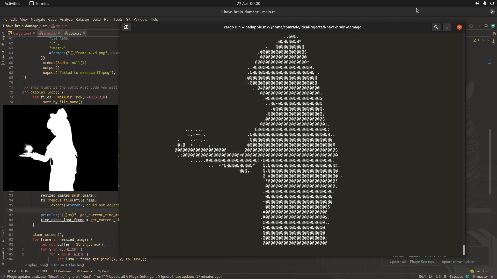

# term-video

Don't use this.

I really just wrote this program to play 'Bad Apple' in my terminal, be happy for 10 seconds that it actually sort of works and then return to the depressing reality.

Do not expect this project to grow into anything larger than that, though I might improve it here or there, depending on how I feel.

# Usage
```cargo run -- <path-to-video>```

Then enjoy your computer fan noises. It should not be too bad, as this program only utilizes a single thread.

# Problems
- It only utilizes a single thread and is therefore painfully slow. To make frame processing 
  bearable, I offloaded it to ffmpeg instead of using a custom Rust implementation as I 
  just could not be bothered reading into threading.

- It's utterly useless.

# Dependencies

[ffmpeg, ffprobe](https://ffmpeg.org/) at runtime

[image-rs](https://github.com/image-rs/image) 0.23.14

[walkdir](https://github.com/BurntSushi/walkdir) 2.3.2

[structopt](https://github.com/TeXitoi/structopt) 0.3.21 (don't be fooled though, its functionality is not implemented yet!)